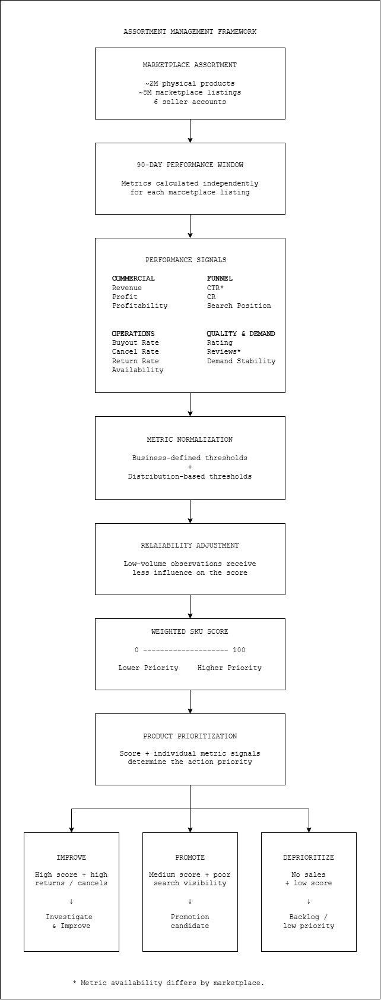
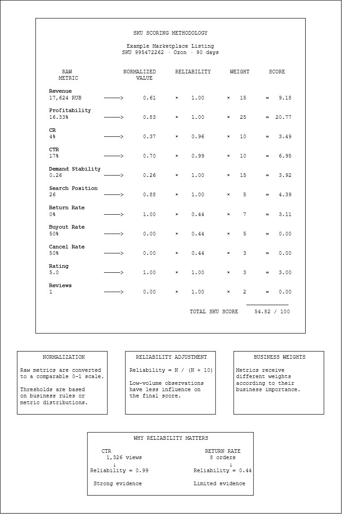
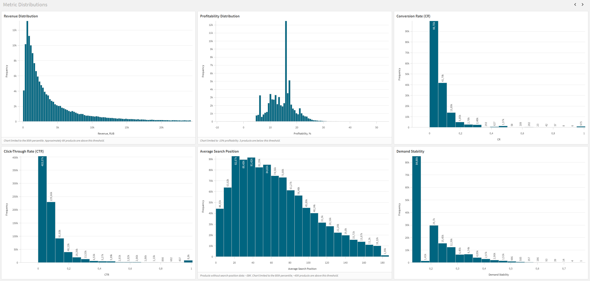
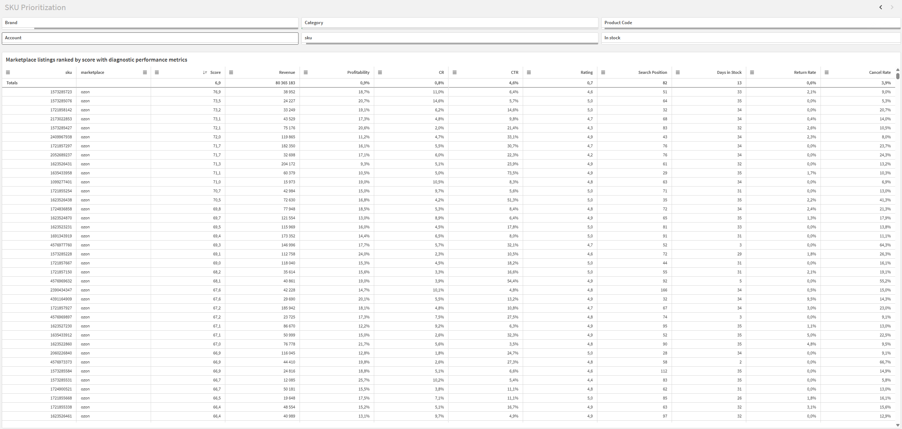

# Marketplace SKU Scoring & Assortment Management

A business-driven scoring system for prioritizing assortment decisions across ~8M marketplace listings and ~2M physical products.

The system converts commercial, funnel, operational, and product-quality signals into a single comparable SKU score, helping marketplace managers identify which products require attention and what type of action should be considered.

---

## Business Problem

The company manages approximately **2M physical products and ~8M marketplace listings** across multiple seller accounts.

Historically, assortment management relied largely on supplier-provided ABC classifications. With more than 100 suppliers, this approach had several limitations:

- each supplier used its own product matrix;
- supplier classifications reflected the supplier's sales rather than our marketplace performance;
- an A-class product for a supplier could have no sales in our channels, while a C-class product could perform well;
- products from different supplier matrices could not be compared consistently;
- manually reviewing millions of marketplace listings was impossible.

Traditional ABC/XYZ segmentation was also insufficient. With a long-tail assortment, hundreds of thousands of products could fall into the same group, without answering the practical question:

> **Which products should marketplace managers work on first, and what should they do with them?**

The project therefore evolved from basic product segmentation into a broader goal:

> **Build a scalable assortment-management system that identifies groups of listings with similar problems, prioritizes them by business value, and supports targeted actions to increase overall profitability.**

---

## Solution

I designed a scoring framework that evaluates each marketplace listing independently using a rolling **90-day performance window**.

The system combines multiple dimensions of product performance:

- commercial performance;
- marketplace funnel performance;
- cancellations, returns and buyouts;
- demand stability;
- search visibility;
- ratings and reviews;
- stock availability.

Each metric is normalized, adjusted for the reliability of the underlying sample where appropriate, weighted according to business priorities, and converted into a single **0–100 SKU score**.

The score is not intended to replace individual metrics. Instead, it acts as a **prioritization layer**: the score indicates which products deserve attention, while individual metric signals help determine the appropriate action.

---

## My Role

I owned the analytical methodology and decision framework for the project.

My responsibilities included:

- translating the initial segmentation request into an assortment-management framework;
- selecting the metrics used to evaluate marketplace listings;
- defining metric weights and normalization rules;
- analyzing metric distributions and selecting scoring thresholds;
- designing reliability adjustments for low-volume observations;
- developing and testing the scoring methodology in Python;
- defining additional data requirements for the DWH;
- coordinating required data additions with the development team;
- validating the scoring model on marketplace data;
- building Qlik views for model analysis and monitoring;
- defining initial business rules for turning score + metric signals into manager actions.

The methodology and required data scope were reviewed with the CEO and CTO.

Developers implemented the required production data ingestion into the DWH and Elasticsearch.

---

## Tech Stack

| Area | Technologies |
|---|---|
| Data processing & scoring | Python, pandas, NumPy |
| Data warehouse | PostgreSQL |
| Analytical / staging data | Elasticsearch |
| BI & model analysis | Qlik Sense |
| Data sources | Ozon, Wildberries, Yandex Market |
| Analytical window | Rolling 90-day marketplace data |

---

# Technical & Analytical Deep Dive

## Assortment Management Framework

The scoring model is part of a broader assortment-management framework designed to convert millions of marketplace listings into prioritized, actionable product groups.



## Scoring Methodology

The scoring model converts metrics with different units and distributions into comparable point contributions.

For each metric:

```text
Raw Metric
    ↓
Normalization
    ↓
Reliability Adjustment
    ↓
Business Weight
    ↓
Metric Score Contribution
```

The individual contributions are then summed into a total score:

```text
Total SKU Score = Σ Metric Score Contributions
```

The maximum theoretical score is **100 points**.

The example below shows the complete calculation for one anonymized marketplace listing.



### 1. Metric Normalization

Raw metrics cannot be compared directly: revenue is measured in RUB, profitability in percent, search position in ranking units, and conversion metrics as rates.

Each metric is therefore converted to a comparable **0–1 scale**.

Two approaches are used to define normalization thresholds:

**Business-defined thresholds** are used when a metric has a meaningful business interpretation.

Examples include:

- profitability;
- return rate;
- cancellation rate;
- buyout rate;
- rating.

**Distribution-based thresholds** are used for highly skewed metrics where fixed boundaries would be less meaningful.

Examples include:

- revenue;
- CR;
- CTR;
- search position.

For selected metrics, the upper scoring boundary is derived from the empirical distribution (for example, the 95th percentile), preventing a small number of extreme observations from dominating the score.



---

## Reliability Adjustment

A major challenge of scoring a large marketplace assortment is the **long tail**.

Many listings have only a few clicks or orders. A conversion or cancellation rate calculated from two observations should not influence the score as strongly as the same rate calculated from hundreds of observations.

For selected metrics, I therefore introduced a reliability coefficient:

```text
Reliability = N / (N + 10)
```

where `N` represents the relevant observation volume.

Examples:

- CTR → number of views;
- CR → number of product-page opens;
- cancellation / buyout / return rates → number of orders.

For example:

```text
8 orders
→ Reliability = 8 / (8 + 10)
→ Reliability = 0.44
```

This means that an observed 0% return rate based on only eight orders receives substantially less influence than the same rate supported by a large order history.

For high-volume signals, reliability approaches `1.0`.

This prevents unstable small-sample metrics from disproportionately affecting product prioritization.

---

## Business-Driven Weights

The model is intentionally a **business scoring model rather than a statistically optimized or ML-based model**.

Metric weights reflect their importance to the business objective.

For the Ozon implementation, the scoring model uses the following structure:

| Metric | Weight |
|---|---:|
| Profitability | 25 |
| Revenue | 15 |
| Demand Stability | 15 |
| CR | 10 |
| CTR | 10 |
| Return Rate | 7 |
| Buyout Rate | 5 |
| Search Position | 5 |
| Cancellation Rate | 3 |
| Rating | 3 |
| Reviews | 2 |
| **Total** | **100** |

The framework is marketplace-independent, while the exact metric set can differ depending on source-data availability.

For example, CTR and review-count signals are available in the Ozon implementation but are not used in the Wildberries version where equivalent source data is unavailable in the current pipeline.

---

## SKU Prioritization

The final score provides a common ranking layer across a very large assortment.

Managers can sort their product pool by score while retaining the individual diagnostic metrics required to understand product performance.



This is important because the score alone does **not** determine the business action.

Instead:

```text
SKU Score + Diagnostic Metrics → Action Priority
```

Initial decision rules include:

| Signal | Suggested Action |
|---|---|
| High score + high cancellation / return rate | Investigate and improve the listing or operational process |
| Medium score + poor search visibility | Candidate for promotion |
| No sales + low score | Deprioritize / move to improvement backlog |

This allows managers to focus limited time on the listings where intervention is more likely to matter.

---

## From Signal to Action: Stock Availability Incident

One early use case demonstrated why multidimensional product monitoring matters.

A previously low-activity SKU suddenly received approximately **60 orders within two days**.

At first glance, the order spike appeared positive. However, the product also showed a sharp increase in cancellations.

Investigation revealed that:

- the supplier had only approximately **20 units available**;
- marketplace stock data had not been updated correctly;
- approximately **40 orders had to be cancelled**;
- the resulting marketplace penalty was approximately **50K RUB**.

The incident led to improvements in stock synchronization and follow-up work with the supplier.

The example illustrates an important principle behind the scoring system:

> **A strong individual signal does not necessarily mean that a product is healthy. Product value and diagnostic metrics must be evaluated together.**

---

## Scale

The model was designed for an assortment where manual product-level analysis is not feasible:

| Dimension | Scale |
|---|---:|
| Physical products | ~2M |
| Marketplace listings | ~8M |
| Seller accounts | 6 |
| Records processed per scoring cycle | ~50–60M |
| Performance window | 90 days |
| Scoring frequency | Every 30 days |
| Scoring runtime | ~1 hour |

Each marketplace listing is scored independently.

The same physical product may therefore receive different scores on different marketplaces because its commercial performance, funnel metrics, visibility, returns and customer behavior can differ significantly between channels.

---

## Current Status

The scoring framework is currently **in development and iterative rollout**, rather than presented here as a finished automated optimization system.

The current implementation already supports:

- ranking large product pools by a common score;
- identifying high-value products with problematic cancellations or returns;
- identifying promotion candidates with reasonable performance but poor search visibility;
- deprioritizing low-score products without sales;
- providing managers with a common analytical view of product performance.

The next major dependency is improving product-level profit calculation using marketplace accrual data and 1C purchase-cost data.

Once profitability is sufficiently reliable, the planned next steps are:

1. finalize action-oriented product groups;
2. formalize decision rules for each group;
3. automate selected high-confidence actions;
4. incorporate scoring signals into a new pricing methodology.

---

## Python Implementation

A simplified and anonymized implementation of the scoring methodology is available here:

[`src/calculate_sku_score.py`](src/calculate_sku_score.py)

The portfolio implementation focuses specifically on the analytical scoring layer:

```text
Prepared SKU Metrics
        ↓
Metric Configuration
        ↓
Normalization
        ↓
Reliability Adjustment
        ↓
Business Weights
        ↓
Metric Contributions
        ↓
Total SKU Score
```

Production-specific data access, SQL queries, API integrations, internal file paths and company-specific operational logic have intentionally been excluded.

---

## Key Design Decisions

### Why not use supplier ABC classifications?

Supplier classifications describe performance within the supplier's own assortment and cannot reliably represent marketplace performance in our channels.

A unified scoring model makes listings comparable using the company's own behavioral and commercial data.

### Why not use only ABC/XYZ analysis?

With millions of long-tail products, traditional segmentation can still produce groups containing hundreds of thousands of listings.

The scoring model creates a continuous ranking that can be combined with diagnostic metrics and action rules.

### Why not use only the final score?

Two products with similar scores may have completely different problems.

One may suffer from poor search visibility, another from cancellations, and another from weak profitability.

The score answers:

> **Which products should we look at first?**

The underlying metrics answer:

> **Why does this product need attention, and what should we do about it?**

### Why use reliability adjustment?

Marketplace metrics for low-volume products are inherently noisy.

Reliability adjustment prevents extreme rates calculated from only a handful of observations from receiving the same influence as signals backed by substantial traffic or order history.

---

## Repository Structure

```text
marketplace-sku-scoring/
│
├── README.md
├── docs/
│   ├── assortment-management-framework.png
│   ├── scoring-methodology.png
│   ├── metric-distributions.png
│   └── sku-prioritization.png
│
└── src/
    └── calculate_sku_score.py
```

---

## Confidentiality

This repository contains a **simplified and anonymized portfolio implementation** of a real internal analytics project.

Company-specific identifiers, internal infrastructure details, production credentials, proprietary data-access logic and sensitive commercial information have been removed or generalized.

The methodology, analytical reasoning and system design reflect the actual project.
